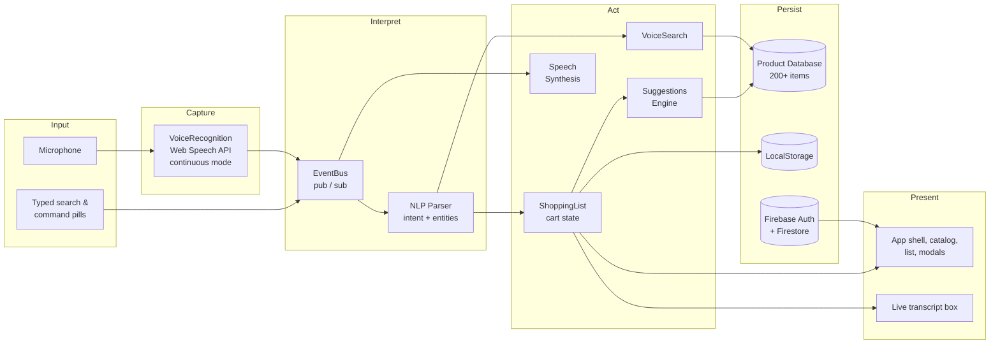

# VoiceCart - AI Shopping Platform with Voice

**Live Demo:** [https://voice-cart-11bca.web.app](https://voice-cart-11bca.web.app) — deployed on Firebase Hosting

**A production-grade, voice-first grocery shopping platform.**

VoiceCart lets users build and manage a shopping cart entirely by voice. Spoken commands are captured with the Web Speech API, parsed by a lightweight natural-language pipeline, and executed against a 200+ item product catalog — with spoken confirmation, live transcription, authentication, and a full checkout flow.

---

## Overview

| | |
|---|---|
| **Product** | VoiceCart — Smart Voice Shopping Platform |
| **Category** | Voice commerce / conversational storefront |
| **Frontend** | Vanilla JavaScript (ES modules), no framework |
| **Build tool** | Vite |
| **Backend services** | Firebase Authentication, Cloud Firestore |
| **Hosting** | Firebase Hosting |
| **License** | MIT |

VoiceCart is intentionally framework-free. The entire application is composed of small, single-responsibility ES modules coordinated through a central publish/subscribe event bus. This keeps the bundle small, the data flow explicit, and the voice pipeline easy to reason about.

---

## Architecture

The system is a unidirectional pipeline: audio is captured, transcribed, interpreted into an intent, executed against domain services, persisted, and finally reflected back to the user through the UI and spoken feedback.



### How a voice command flows

1. **Capture** — `VoiceRecognition` wraps the Web Speech API in continuous mode with interim results. A watchdog restarts any session that goes silent, and a settle delay avoids racing the audio device between permission grant and recognition start.
2. **Interpret** — Finalized transcripts are published on the `EventBus`. The `NLPParser` extracts an intent (add, remove, search, substitute, recommend, help, etc.) along with entities such as item names, quantities, units, and price caps.
3. **Act** — The command router dispatches to a handler that mutates the `ShoppingList`, queries the `Suggestions` engine, or runs a `VoiceSearch`.
4. **Persist** — Cart state is written to `LocalStorage`; user identity and session data are handled by Firebase Authentication and Firestore.
5. **Present** — The UI re-renders from event-bus notifications, the live transcript box shows what was heard, and `SpeechSynthesis` speaks a confirmation.

---

## Features

### Voice interaction
- Continuous, multilingual speech recognition across 14 languages.
- Real-time interim transcription shown in a compact box beneath the microphone.
- Automatic session recovery for silent or stalled recognition sessions.
- Spoken responses via the Web Speech Synthesis API with graceful fallbacks.

### Natural-language commands
- Understands natural phrasing such as `Add 2 gallons of milk` and `Find toothpaste under $5`.
- Supports add, remove, check-off, clear, read, search, substitute, recommend, and help intents.
- Quantity, unit, and price-constraint extraction from free speech.

### Commerce
- Catalog of 200+ grocery items across 11 categories with real product photography.
- One-click add from the catalog and from seasonal spotlight cards.
- Smart suggestions: restock alerts, in-season picks, and dietary substitutes.
- Multi-step checkout with address editor, delivery slots, payment options, and promo codes.

### Accounts
- Email and password authentication with validation and friendly errors.
- Google sign-in via OAuth.
- Session persistence and a user profile badge in the header.

---

## Tech Stack

| Layer | Technology |
|---|---|
| Language | JavaScript (ES2022 modules) |
| Build | Vite |
| Speech input | Web Speech API (`SpeechRecognition`) |
| Speech output | Web Speech Synthesis API |
| Auth & data | Firebase Authentication, Cloud Firestore |
| Hosting | Firebase Hosting |
| Styling | Hand-authored CSS with design tokens |

---

## Project Structure

```
voice-cart/
├── index.html                  # App entry point
├── vite.config.js              # Vite configuration
├── firebase.json               # Firebase Hosting configuration
├── .env.example                # Environment variable template (safe to commit)
├── .env                        # Real credentials (gitignored, never committed)
├── public/
│   └── favicon.svg
└── src/
    ├── main.js                 # Bootstrap + command pipeline wiring
    ├── data/
    │   ├── productDatabase.js  # Catalog, categories, categorization, images
    │   └── translations.js     # i18n strings and currency formatting
    ├── modules/
    │   ├── voiceRecognition.js # Web Speech API wrapper + watchdog
    │   ├── nlpParser.js        # Intent and entity extraction
    │   ├── shoppingList.js     # Cart state and persistence
    │   ├── speechSynthesis.js  # Spoken feedback with fallbacks
    │   ├── suggestions.js      # Restock, seasonal, substitute logic
    │   └── voiceSearch.js      # Catalog search with filters
    ├── ui/
    │   ├── app.js              # App shell and layout
    │   ├── voiceButton.js      # Microphone control
    │   ├── transcriptDisplay.js# Live transcript box
    │   ├── authModal.js        # Sign-in / sign-up
    │   ├── checkoutModal.js    # Checkout flow
    │   ├── searchOverlay.js    # Command-K search
    │   ├── languageSelector.js # Language picker
    │   ├── locationModal.js    # Delivery location
    │   ├── seasonalSpotlight.js# Rotating fresh picks
    │   ├── shoppingListView.js # Cart rendering
    │   ├── suggestionCards.js  # Recommendations hub
    │   ├── voiceOnlyModal.js   # Hands-free cockpit
    │   └── feedbackToast.js    # Toast notifications
    ├── utils/
    │   ├── eventBus.js         # Pub/sub messaging
    │   ├── storage.js          # Safe LocalStorage wrapper
    │   ├── firebaseAuth.js     # Firebase init and auth API
    │   ├── locationService.js  # Delivery location resolution
    │   ├── audioFeedback.js    # UI sound cues
    │   └── openFoodFacts.js    # Optional product data source
    └── styles/
        ├── variables.css       # Design tokens
        ├── base.css            # Resets and globals
        ├── components.css      # Component styles
        ├── animations.css      # Motion
        └── index.css           # Aggregator
```

---

## Getting Started

### Prerequisites

- Node.js 18 or newer
- npm 9 or newer
- A Chromium-based browser (Chrome or Edge) for speech recognition
- A Firebase project (for authentication and Firestore)

### Installation

```bash
# Clone the repository
git clone https://github.com/udii05/voice-cart.git
cd voice-cart

# Install dependencies
npm install

# Start the development server
npm run dev
```

The app is served at `http://localhost:5173/`.

> Speech recognition requires a secure context. Localhost is treated as secure, so local development works out of the box. For any other host, serve over HTTPS.

### Production build

```bash
# Build the production bundle into dist/
npm run build

# Preview the production build locally
npm run preview
```

---

## Firebase Configuration

VoiceCart reads all Firebase credentials from environment variables. Your real credentials live in a local `.env` file that is **gitignored and never committed**. A placeholder template, `.env.example`, is committed instead.

### Setup

1. Copy the template and fill in your values:

   ```bash
   cp .env.example .env
   ```

2. In the [Firebase Console](https://console.firebase.google.com), open your project, then go to **Project Settings → General → Your apps → Web app** and copy the config values into `.env`:

   ```
   VITE_FIREBASE_API_KEY=your-api-key
   VITE_FIREBASE_AUTH_DOMAIN=your-project.firebaseapp.com
   VITE_FIREBASE_PROJECT_ID=your-project
   VITE_FIREBASE_STORAGE_BUCKET=your-project.appspot.com
   VITE_FIREBASE_MESSAGING_SENDER_ID=123456789012
   VITE_FIREBASE_APP_ID=1:123456789012:web:abcdef123456
   ```

3. Enable **Authentication → Sign-in method → Email/Password and Google**. Under **Authorized domains**, add your deployment domain (localhost is included by default).

4. Create a **Cloud Firestore** database and configure security rules appropriate for your environment.

The app degrades gracefully when Firebase is not configured: authentication surfaces show a setup prompt instead of failing, and all shopping features continue to work locally.

---

## Voice Command Reference

| Intent | Example phrases |
|---|---|
| Add item | "Add 2 gallons of milk", "I need eggs and bread" |
| Remove item | "Remove butter from my list" |
| Check off | "I got the apples" |
| Clear list | "Clear my list" |
| Read list | "Read my list" |
| Search | "Find toothpaste under $5" |
| Substitute | "Substitute for milk", "Swap milk with almond milk" |
| Recommendations | "What should I buy?", "What's in season?" |
| Help | "Help", "What can I say?" |

---

## Deployment

VoiceCart deploys to Firebase Hosting. The hosting configuration lives in `firebase.json` and serves the built `dist/` directory with a single-page-app rewrite.

```bash
# Build, then deploy
npm run build
firebase deploy
```

---

## Security Notes

- Real Firebase credentials are stored only in a local, gitignored `.env` file. They are not present in the repository history.
- Only `.env.example` (with placeholders) is committed, so the project can be cloned and configured safely.
- No API keys are hard-coded in source; all Firebase values are read from environment variables at build time.
- If you ever suspect a key has been exposed, rotate it in the Firebase Console and update your local `.env`.

---

## License

MIT
